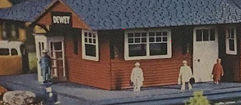
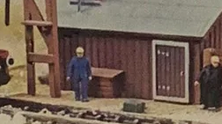
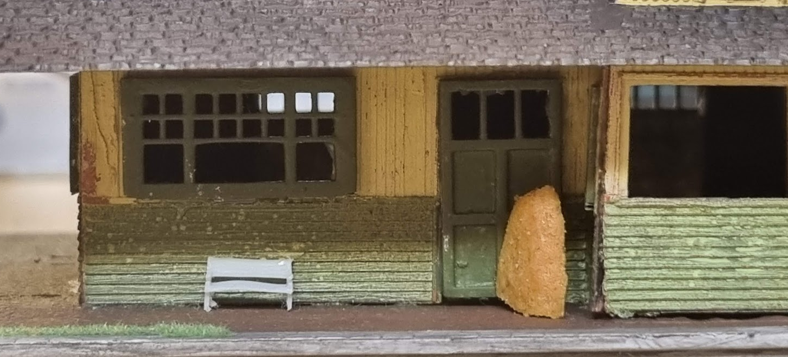
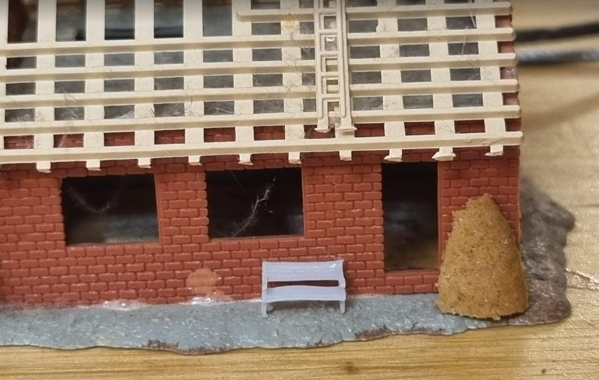
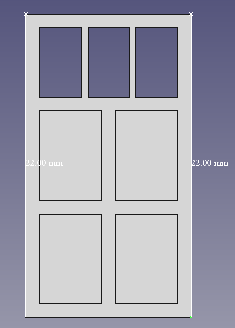
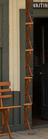
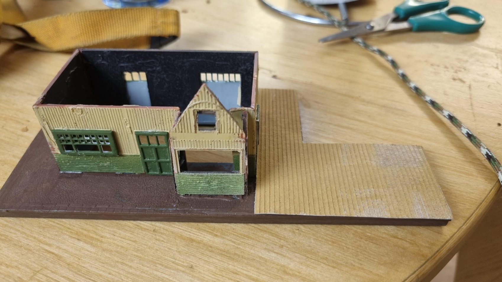

# What scale is this station?

## One thing we know is that it is not N

I've incorrectly assumed that it is N-scale - the roof above the platforms are at a reasonable height for passenger cars, I got it for my N-scale kit at some birthday or xmas, and the back side says "Pola-N".
Then, without anything to compare to and obviously no deeper thought when I cadded the windows, it completely slipped me that this station is _huge_ and nowhere near 1:160 in scale.

The same model seems to be [sold under a few different brand names](http://milesofgold000nscale.blogspot.com/2014/06/cont.html), searching for combinations of the names + "scale" found [a post on the trains.com message board asking about the scale](https://cs.trains.com/mrr/f/88/t/64804.aspx?sortorder=desc):

*I think it may be HO scale though the box says otherwise.... Compared to my Walthers stuff, one floor of the passenger station is one and a half of the state street stores, etc* - NinjaRob@Trains.com

A few pictures to make the point:


This is a picture of the original packaging. Part of a photo from [House of Hobbies](https://houseofhobbiesfl.com/) - [Full photo on their product page](https://houseofhobbiesfl.com/products/pola-n-scale-passenger-station-building-kit-300?_pos=3&_sid=a84281e1b&_ss=r)
Look at the miniature people, they are half the height of the door!

Pola _were_ able to make proper models - for example, [this kit also sold by House of Hobbies](https://houseofhobbiesfl.com/products/pola-n-scale-industrial-trackside-sand-building-247?_pos=2&_sid=a84281e1b&_ss=r), but obviously not the station one...



Let's put an N-scale bench on the station and also on a couple of other old kits I have:



The gingerbread is about the height of a grown person.




## So, what scale is it really?

Obviously, the station is way, way too large for N!
The small door is 22 mm tall.



|Scale|Prototype height|
|---|---|
| N (1:160) | 3.5 meters |
| H0 (1:87) | 1.9 meters |
| TT (1:120) | 2.6 meters |

Neither of these makes sense. TT is probably the closest, but it is still a bit too big for TT. H0 will likely look ridicuously small, in particular since the station roof looks decent with N-scale wagons.

Let's look at it the other way around - if we know what the door height is, which scale is the model?

A standard US door is (according to internet, 80 inches, or 200 cm. Let's also look at [this photo of the Grand Trunk Petersburg station](https://www.cweek.ca/photo/show/189) and see if we can figure something out. The seat of the bench is likely 45-50 cm from the ground, which puts the door at something like 4.5*45 = 200 cm as well.



 


# Restoration Progress

## Before restoration

I got this station some time early 1980's, my best guess is that I was 11-13 at the time. The assembly was as expected, and the building was falling apart from using the wrong glue.
The paper on the inside was an attempt to remove severe light leakage through the walls.


## Disassembly

To be able to fix the station, I pulled it apart. Thanks to the cheap glue most of the larger parts and the roof braces came out okay, but the windows were more or less beyond saving, so I decided to make new ones using the 3D-printer.


## Painting the walls

I started by covering the walls with white primer (Ammo-Mig OneShot, IIRC), then applied a coat of yellow Vallejo 70976 buff (which needed serious thinning to be airbrushed).
Then I masked the upper part (the vertical planks) and coated the horizontal planks with Ammo-mig A.MIG-0065 "forest green" aiming at a similar paint scheme as the [Grand Trunk Railway's Petersburg station](https://www.cweek.ca/photo/show/189).
Finally, the inside of the wall parts were coated black in an attempt to remove as much light leakage as possible. 


The green is not 100% covering the yellow. This looks worse close up than in real life, in real life it contributes to the slightly worn down look I'm after - the model is a bit beaten up and will never look perfect, so I need to run with what I have. 


# 3D-models for the doors and windows

## Printing the models.

Print the doors and windows on an SLA printer.

Needed:

* 1 [large door](large_door.stl)
* 2 [small door](small_door.stl)
* 2 [large window](large_windows.stl)
* 2 [second largest window](second_largest_window.stl)
* 1 [third largest window](third_largest_window.stl)
* 6 [smallest window](smallest_windows.stl)
* 1 [second smallest window](second_smallest_windows.stl) - this is a resize of the smallest window

Printed result: [video](media/curing_video.mp4)


The windows are way too thick (~15 cm to scale), but it will hopefully not be too visible. I'm still calibrating to new resin, it is likely possible to reduce the thickness at least to 0.5 mm.

## Painting and cleaning the doors and windows

After curing the models, I covered them with white primer. The support rafts were quite handy when painting.
The finishing paint is Ammo-MIG "forest green". 


# Other Parts
## Platform Roof


The platform roof is a remix of [Chibbyreen's design on Thingiverse](https://www.thingiverse.com/thing:5039844).
```
Shingle Roofs
by ChibbyReen is licensed under the Creative Commons - Attribution - Share Alike license.
```

## Floor planks

An [SVG file with 2 mm wide boxes](floorboards.svg) suitable for making floor planks on a Cricut or similar machine. They are obviously too wide, this was a test run. I'm quite pleased with the result.
The variations in color is caused by using varying amounts of paint, a thicker paint is needed to avoid disturbing the surface of the cereal box cardboard too much. 



I like the look of the planks, but will not use them for the station. May move to another repo later.

## Gable end for the station roof

Since both the platform roof and its gable end were gone, I created a [simple gable end](end_planks.stl) that is printable either on a decent FDM printer or an SLA printer.
Print 1-2 as needed.


