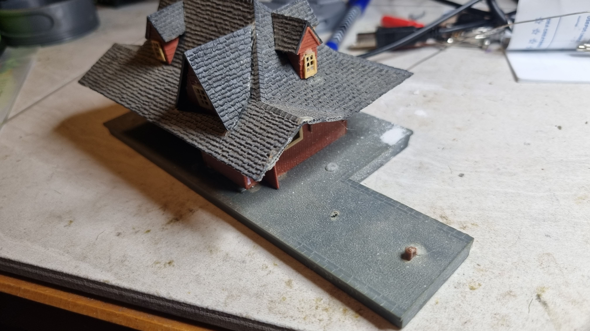
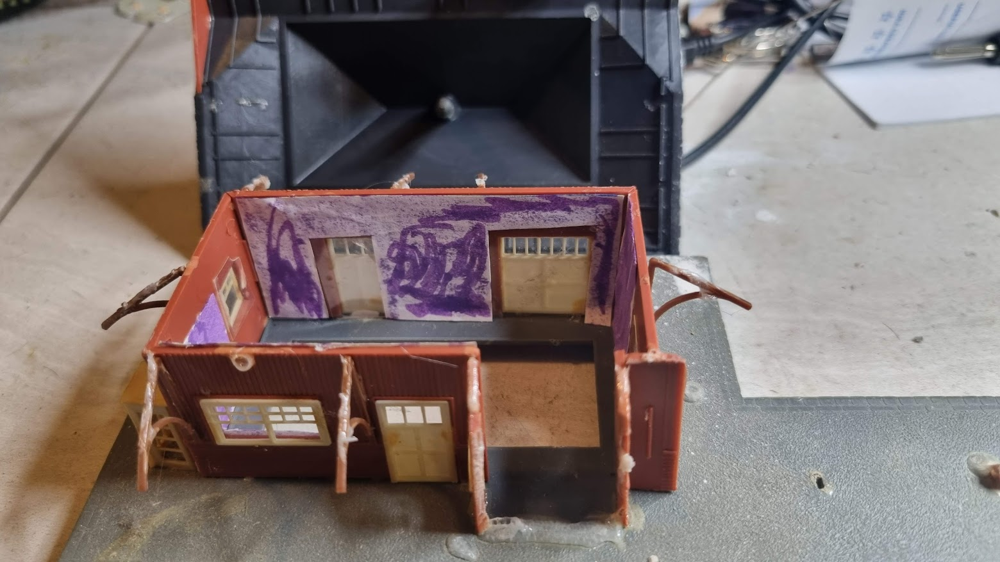
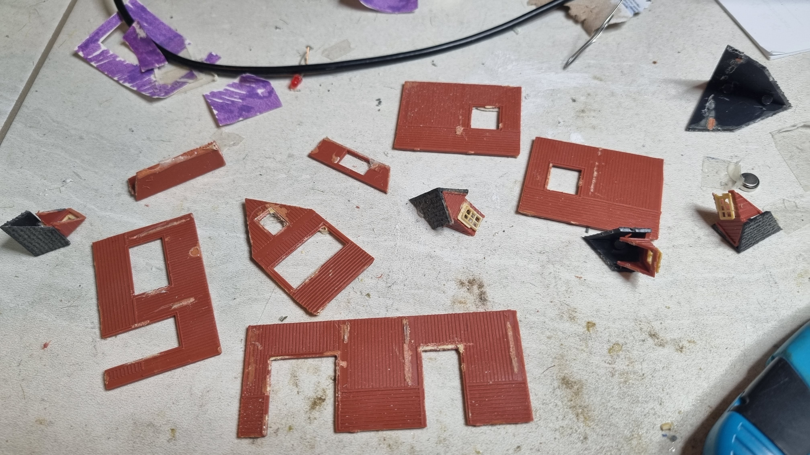
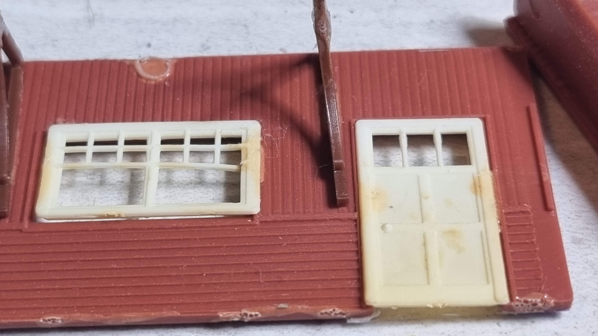
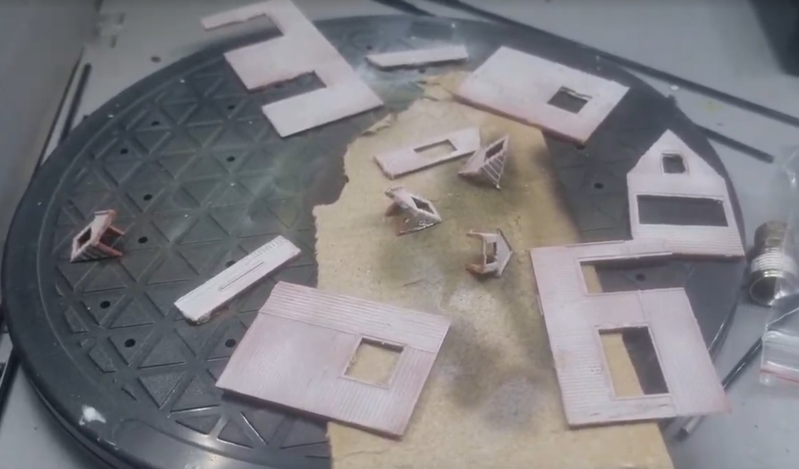
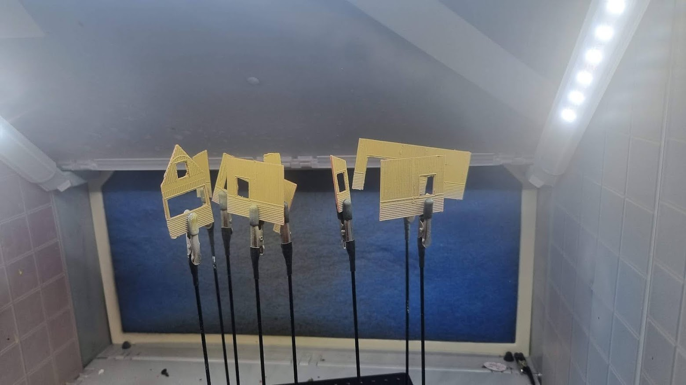
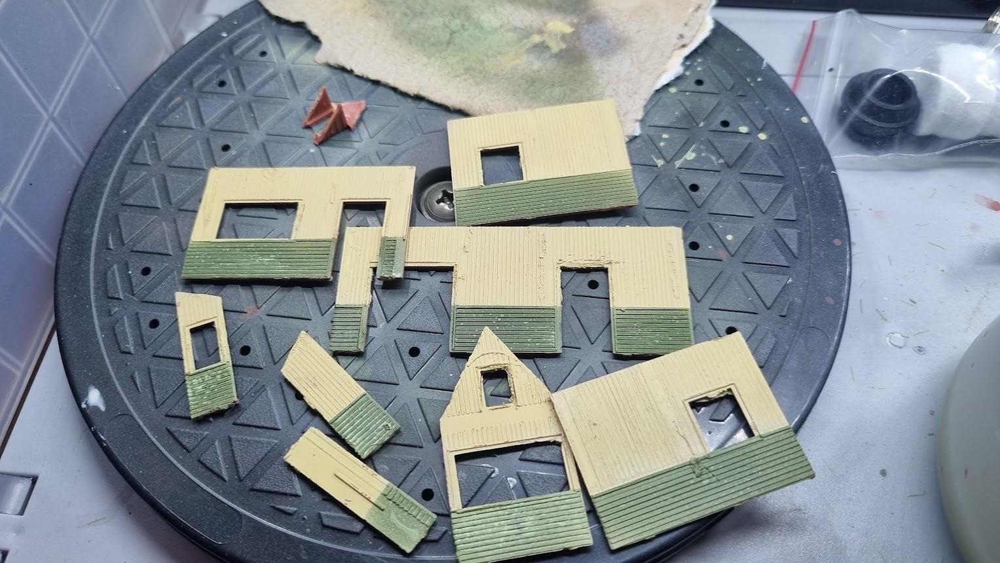
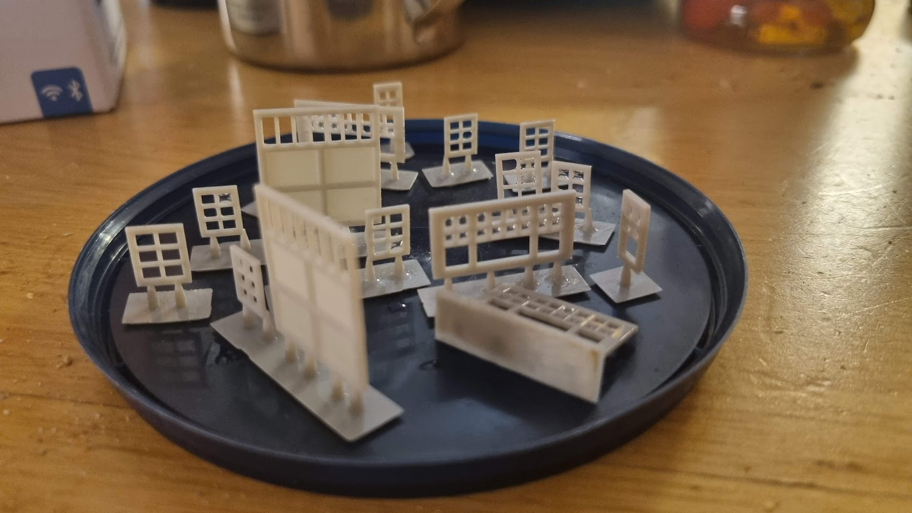
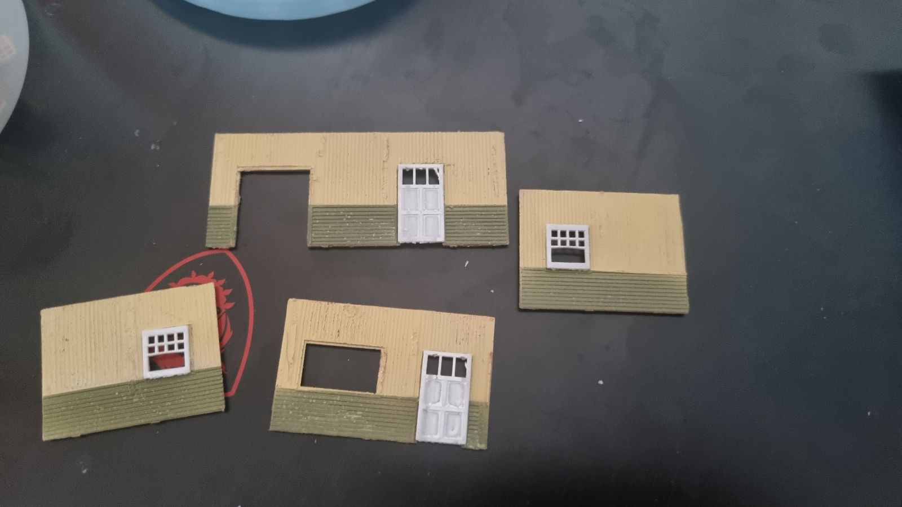

# Restoration Progress

## Before restoration

I got this station some time early 1980's, my best guess is that I was 11-13 at the time. The assembly was as expected, and the building was falling apart from using the wrong glue.
The paper on the inside was an attempt to remove severe light leakage through the walls.

## Disassembly

To be able to fix the station, I pulled it apart. Thanks to the cheap glue most of the larger parts and the roof braces came out okay, but the windows were more or less beyond saving, so I decided to make new ones using the 3D-printer.

## Painting the walls

I started by covering the walls with white primer (Ammo-Mig OneShot, IIRC), then applied a coat of yellow Vallejo 70976 buff (which needed serious thinning to be airbrushed).
Then I masked the upper part (the vertical planks) and coated the horizontal planks with Ammo-mig A.MIG-0065 "forest green" aiming at a similar paint scheme as the [Grand Trunk Railway's Petersburg station](https://www.cweek.ca/photo/show/189).
Finally, the inside of the wall parts were coated black in an attempt to remove as much light leakage as possible. 

The green is not 100% covering the yellow. This looks worse close up than in real life, in real life it contributes to the slightly worn down look I'm after - the model is a bit beaten up and will never look perfect, so I need to run with what I have. 

# 3D-models for the doors and windows

## Printing the models.

Print using an SLA printer.

Needed:

* 1 [large door](large_door.stl)
* 2 [small door](small_door.stl)
* 2 [large window](large_windows.stl)
* 2 [second largest window](second_largest_window.stl)
* 1 [third largest window](third_largest_window.stl
* 6 [smallest window](smallest_windows.stl)
* 1 [second smallest window](second_smallest_windows.stl) - this is a resize of the smallest window

Printed result: [video](media/curing_video.mp4)

The windows are way too thick (~15 cm to scale), but it will hopefully not be too visible. I'm still calibrating to new resin, it is likely possible to reduce the thickness at least to 0.5 mm.

## Painting and cleaning the doors and windows

After curing the models, I covered them with white primer. The support rafts were quite handy when painting.

